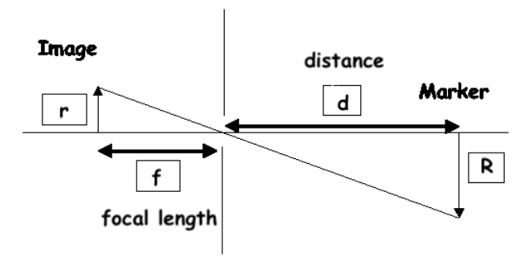
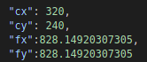
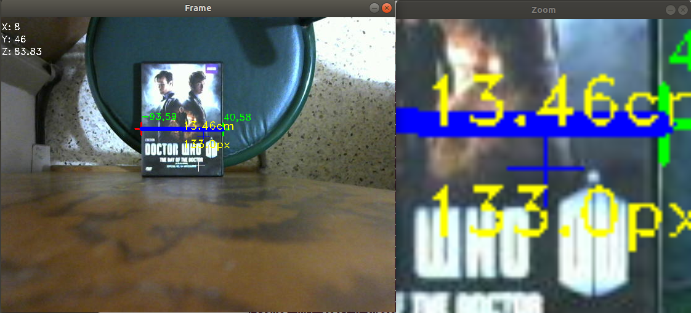
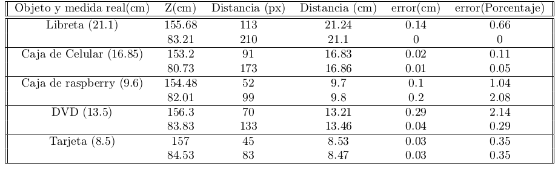

# Camera Measure

Algorithm development in python, with the aim of measuring objects with a camera and with an error of 1mm. All of this bases on the next diagram with constant Z distance for avoid the need of a stereo camera:

 

This code need the json file, that include the camera parameters:

 


## Getting Started

For the use of this code we will need some libraries, a mono-camera, and python3.

### Prerequisites

For the compile we will need some libraries for python3.

* Numpy
```
pip3 install numpy
```

* Opencv
```
sudo apt update
sudo apt install python3-opencv
```


### Installing


Download the project

```
git clone https://github.com/AngelVelazquezR/CameraMeasure.git
```

## Running the tests

For running a test we have to go to code folder.

```
cd CameraMeasure
cd code
```
And running the the main.py with the neccesaries parameters (cam id, json config file, and z distance(cm))


```
python3 main.py -i 0 -c config.json -z 10
```

### Main executed

 Two frame will be shows, one with the camera view and another with a zoom around the mouse, in order to get a measure we have to right-click and left-click in the borders of the object.

 

### Results

These are some results of difference objects in difference distances.

 

## Authors

* **Angel Velazquez** - *Initial work* - [GitHub](https://github.com/AngelVelazquezR)

